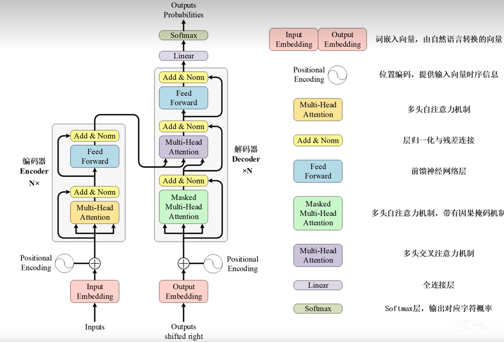
# 1.输入：
按出现次数排序
汉字编码的问题：1 + 2 = 3，其实语义不满足 -->改为独热编码

## 词嵌入：Word Embedding
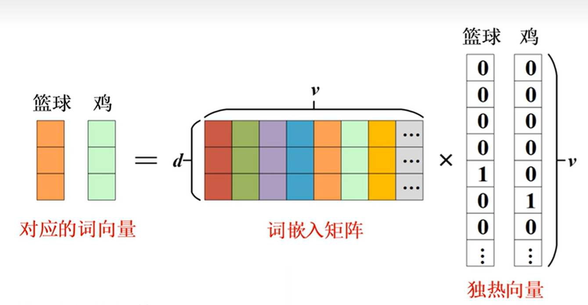
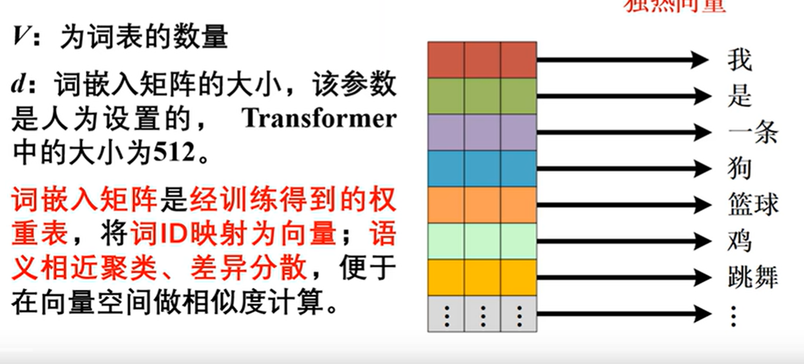
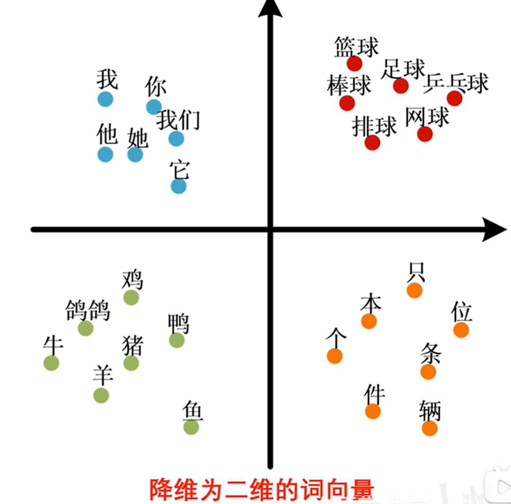
## 位置编码：Position Encoding
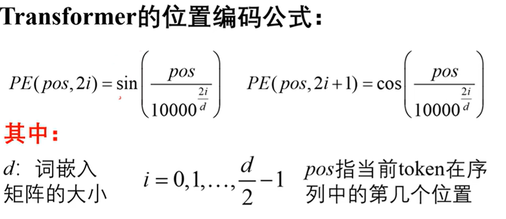
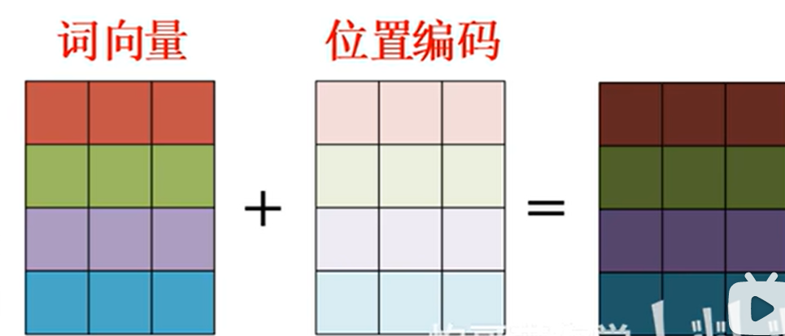

输入的x为：[batch_size,ctx_length,d_model]
           批次，     文字长度，   学习维度
只有后两个维度和W做计算
## 自注意力机制
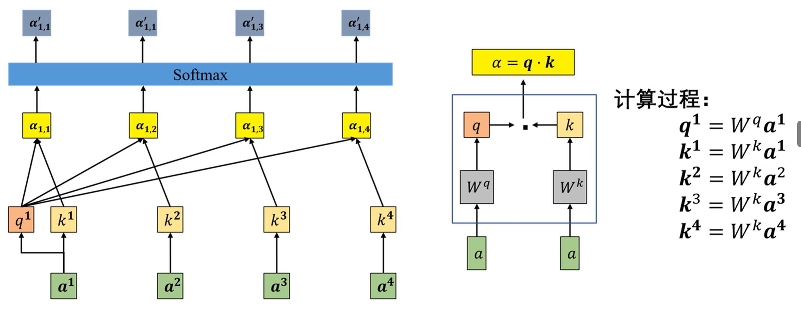
1.计算输入x之间的关联程度
2.根据关联程度提取x的有用信息
3.输出包含不同注意力分配的信息
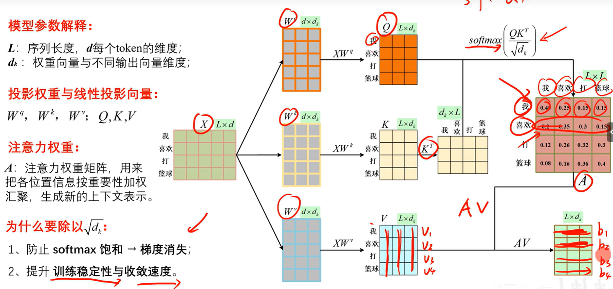
***多头***
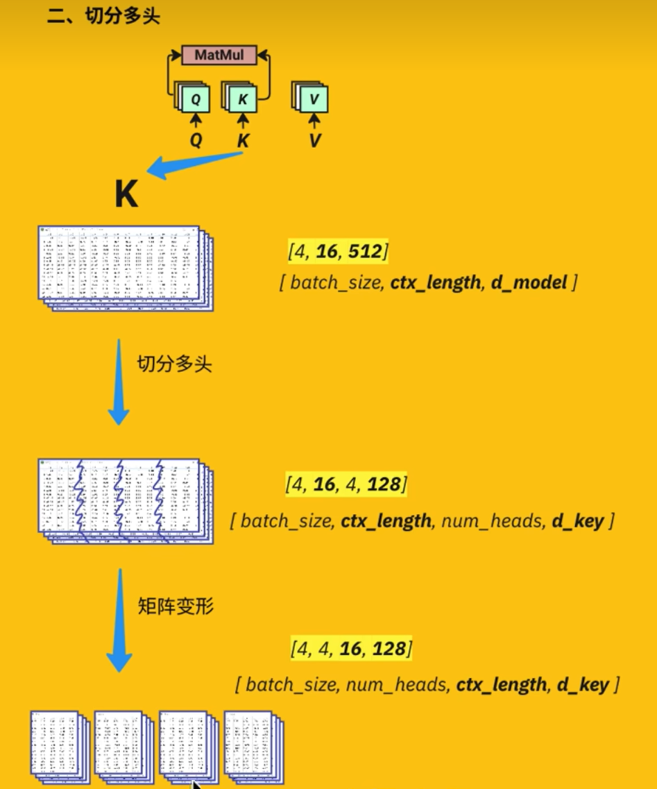
这里不是切分而是投影
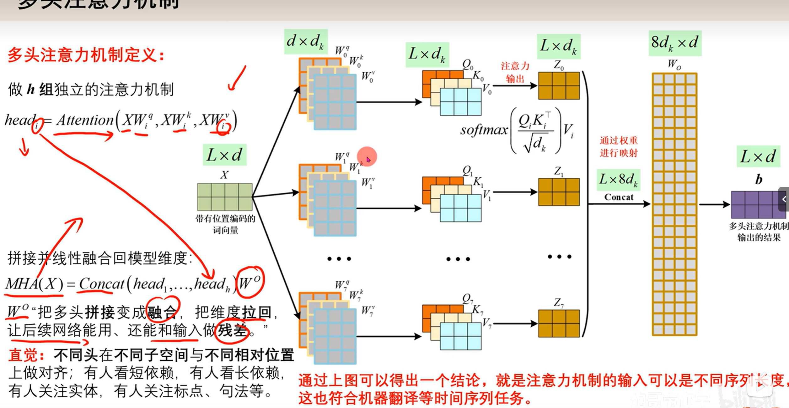
***掩码***
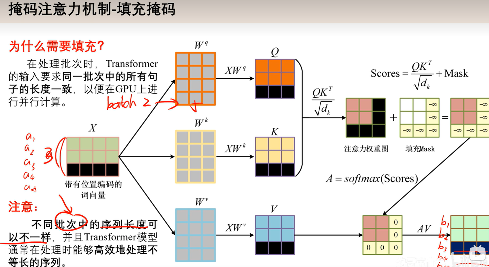

## 层归一化
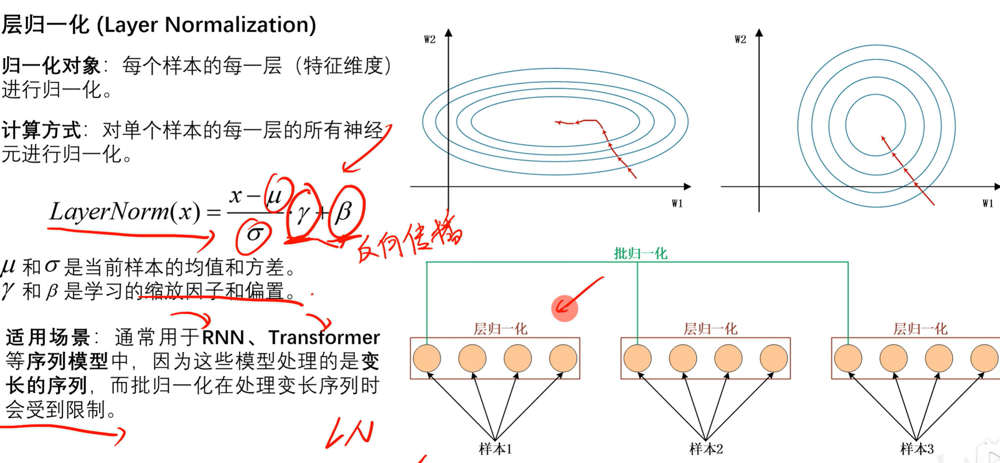
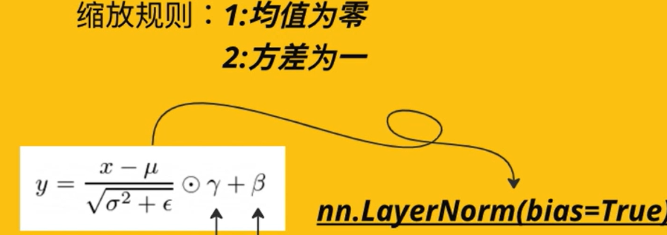

## 因果掩码
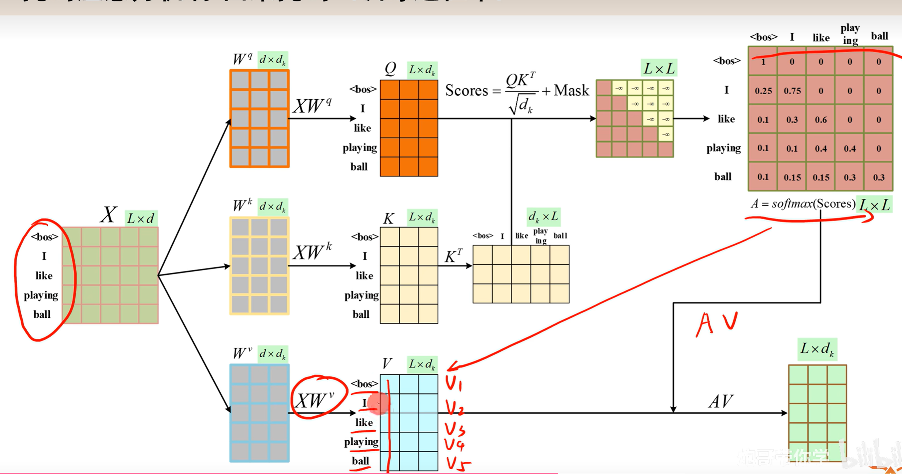

## 交叉注意力机制
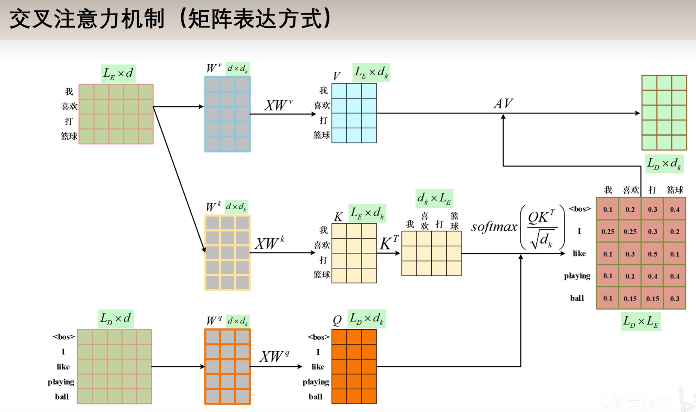
